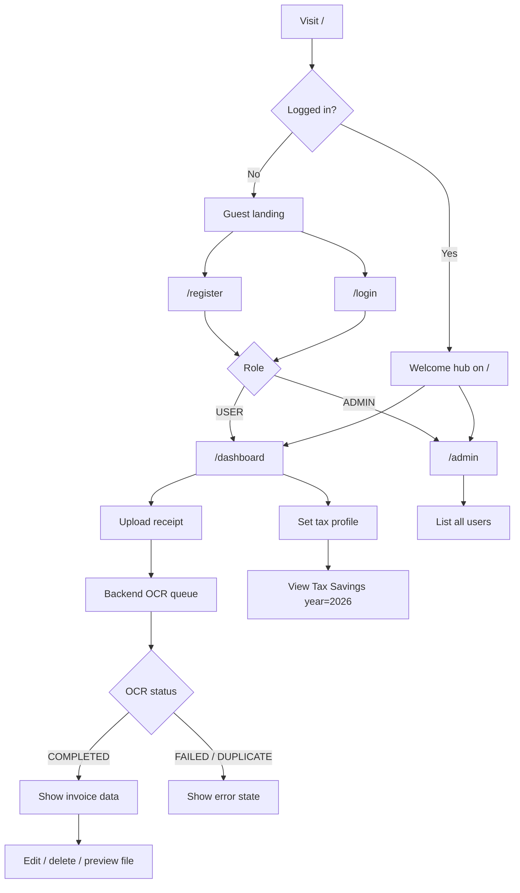
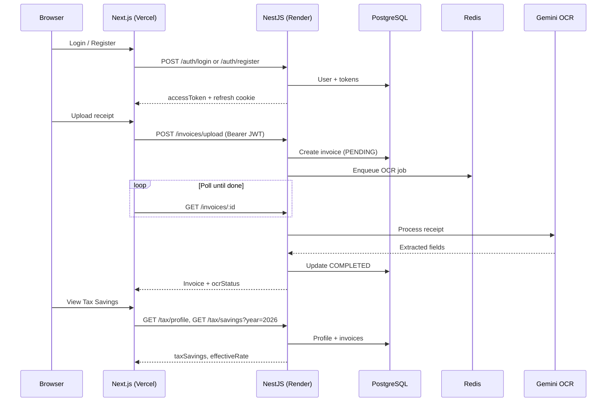

# 📌 TaxSmart AI — Frontend

> Next.js web app for freelancers and SMEs to upload receipt invoices, run AI OCR, and view estimated **Tax Savings** (Effective-Rate Shield, tax year 2026).

[](https://nextjs.org/)
[](https://react.dev/)
[](https://www.typescriptlang.org/)
[](https://nodejs.org/)

**Live app:** [taxsmart-frontend.vercel.app](https://taxsmart-frontend.vercel.app)

---

## 📖 Table of Contents

- [Features](#-features)
- [How It Works](#-how-it-works)
- [Tech Stack](#-tech-stack)
- [Project Structure](#-project-structure)
- [Getting Started](#-getting-started)
- [Environment Variables](#-environment-variables)
- [Pages & Routes](#-pages--routes)
- [Backend API Reference](#-backend-api-reference)
- [Deployment](#-deployment)
- [Related Repositories](#-related-repositories)
- [Author](#-author)

---

## ✨ Features

- **Authentication** — Register, login, JWT access token + httpOnly refresh cookie, session restore, role-based redirect (`USER` → dashboard, `ADMIN` → admin)
- **Homepage** — Guest landing (hero, features, CTA) or logged-in welcome hub with summary cards and recent invoices
- **Invoice dashboard** — Upload receipts, OCR status polling, search/filter, edit, delete, secure file preview via API
- **Tax Savings v1** — Tax profile (Individual / Corporate), estimated income, savings from backend rules (not a hardcoded 15% rate)
- **Admin panel** — List all users (`ADMIN` role only)
- **UX polish** — Skeleton loaders, mobile-friendly card layouts, centralized UI copy

---

## 🔄 How It Works

### User journey



### Request flow (frontend ↔ backend)



---

## 🛠️ Tech Stack

| Layer | Technology |
|-------|------------|
| **Framework** | [Next.js 16](https://nextjs.org/) (App Router) |
| **UI** | [React 19](https://react.dev/), [Tailwind CSS v4](https://tailwindcss.com/) |
| **Language** | TypeScript 5 |
| **Lint** | ESLint 9 + `eslint-config-next` |
| **API client** | Native `fetch` with JWT refresh (`src/lib/api-client.ts`) |
| **Backend** | [NestJS API](https://github.com/Kaopan11/taxsmart-backend) (separate repo) |
| **Deploy** | [Vercel](https://vercel.com/) |

---

## 📁 Project Structure

```text
taxsmart-frontend/
├── public/                 # Static assets
├── src/
│   ├── app/                # Next.js App Router pages
│   │   ├── (auth)/         # login, register
│   │   ├── admin/          # Admin user list
│   │   ├── dashboard/      # Invoice + tax savings dashboard
│   │   ├── layout.tsx
│   │   └── page.tsx        # Homepage (guest or logged-in hub)
│   ├── components/
│   │   ├── admin/
│   │   ├── auth/
│   │   ├── homepage/
│   │   ├── invoices/
│   │   ├── layout/
│   │   ├── skeletons/
│   │   ├── tax/
│   │   └── ui/
│   └── lib/                # API clients, auth storage, UI copy
│       ├── admin-api.ts
│       ├── api-client.ts
│       ├── auth-api.ts
│       ├── auth-storage.ts
│       ├── invoice-display.ts
│       ├── invoices-api.ts
│       ├── tax-api.ts
│       └── ui-copy.ts
├── .env.example            # Environment template (copy → .env.local)
├── next.config.ts
├── package.json
└── tsconfig.json
```

---

## 🚀 Getting Started

### Prerequisites

- **Node.js 18+**
- **npm** (or yarn / pnpm / bun)
- Running [taxsmart-backend](https://github.com/Kaopan11/taxsmart-backend) locally (default port `3000`) or a deployed API URL

### Install and run

```bash
# Clone the repo
git clone https://github.com/Kaopan11/taxsmart-frontend.git
cd taxsmart-frontend

# Install dependencies
npm install

# Copy environment template
cp .env.example .env.local
# Edit NEXT_PUBLIC_API_URL if your backend is not on localhost:3000

# Start dev server
npm run dev
```

Open [http://localhost:3000](http://localhost:3000) in your browser.

### Scripts

| Command | Description |
|---------|-------------|
| `npm run dev` | Start development server |
| `npm run build` | Production build |
| `npm run start` | Run production build locally |
| `npm run lint` | Run ESLint |

---

## 🔐 Environment Variables

Copy [`.env.example`](.env.example) to `.env.local` (gitignored).

| Variable | Required | Description |
|----------|----------|-------------|
| `NEXT_PUBLIC_API_URL` | Yes | NestJS backend base URL. **No trailing slash.** Default fallback in code: `http://localhost:3000` |

**Local example**

```env
NEXT_PUBLIC_API_URL=http://localhost:3000
```

**Production (Vercel)**

Set in Project → Settings → Environment Variables:

```env
NEXT_PUBLIC_API_URL=https://taxsmart-backend-u5eh.onrender.com
```

> The backend must allow this frontend origin in `CORS_ORIGINS` (no trailing slash).

---

## 🗺️ Pages & Routes

| Route | Description | Auth |
|-------|-------------|------|
| `/` | Guest landing or logged-in welcome hub | Optional |
| `/login` | Sign in | Public |
| `/register` | Create account | Public |
| `/dashboard` | Invoices, upload/OCR, tax profile, tax savings | `USER` or `ADMIN` |
| `/admin` | System user list | `ADMIN` only |

After login, users are redirected by role (`getPostAuthPath` in `auth-storage.ts`).

---

## 📡 Backend API Reference

This frontend consumes the NestJS API. Full implementation lives in [taxsmart-backend](https://github.com/Kaopan11/taxsmart-backend).

| Module | Method | Endpoint | Used in |
|--------|--------|----------|---------|
| Auth | POST | `/auth/register` | `auth-api.ts` |
| Auth | POST | `/auth/login` | `auth-api.ts` |
| Auth | POST | `/auth/refresh` | `auth-api.ts` |
| Auth | GET | `/auth/me` | `auth-api.ts` |
| Auth | POST | `/auth/logout` | `auth-api.ts` |
| Invoices | POST | `/invoices/upload` | `invoices-api.ts` |
| Invoices | GET | `/invoices` | `invoices-api.ts` |
| Invoices | GET | `/invoices/:id` | `invoices-api.ts` |
| Invoices | PATCH | `/invoices/:id` | `invoices-api.ts` |
| Invoices | DELETE | `/invoices/:id` | `invoices-api.ts` |
| Invoices | GET | `/invoices/:id/file` | `invoices-api.ts` |
| Tax | GET | `/tax/profile` | `tax-api.ts` |
| Tax | PUT | `/tax/profile` | `tax-api.ts` |
| Tax | GET | `/tax/savings?year=` | `tax-api.ts` |
| Admin | GET | `/admin/users` | `admin-api.ts` |

Authenticated requests send `Authorization: Bearer <accessToken>` and `credentials: "include"` for refresh cookies.

---

## ☁️ Deployment

### Vercel (recommended)

1. Import [Kaopan11/taxsmart-frontend](https://github.com/Kaopan11/taxsmart-frontend) on Vercel.
2. Set **`NEXT_PUBLIC_API_URL`** to your production backend URL.
3. Deploy from `main`.

### Backend requirements

- Deploy [taxsmart-backend](https://github.com/Kaopan11/taxsmart-backend) (e.g. Render).
- Set `CORS_ORIGINS` to include your Vercel URL, e.g. `https://taxsmart-frontend.vercel.app`.
- Ensure Postgres migrations are applied on the production database.

See [Next.js deployment docs](https://nextjs.org/docs/app/building-your-application/deploying) for more options.

---

## 🔗 Related Repositories

| Repository | Link |
|------------|------|
| **Frontend** (this repo) | [github.com/Kaopan11/taxsmart-frontend](https://github.com/Kaopan11/taxsmart-frontend) |
| **Backend API** | [github.com/Kaopan11/taxsmart-backend](https://github.com/Kaopan11/taxsmart-backend) |

---

## 👤 Author

**Kaopan11** — [GitHub](https://github.com/Kaopan11)

---

Built with [Next.js](https://nextjs.org/). Documentation structure inspired by [FreeCodeCamp README best practices](https://www.freecodecamp.org/news/how-to-write-a-good-readme-file).
